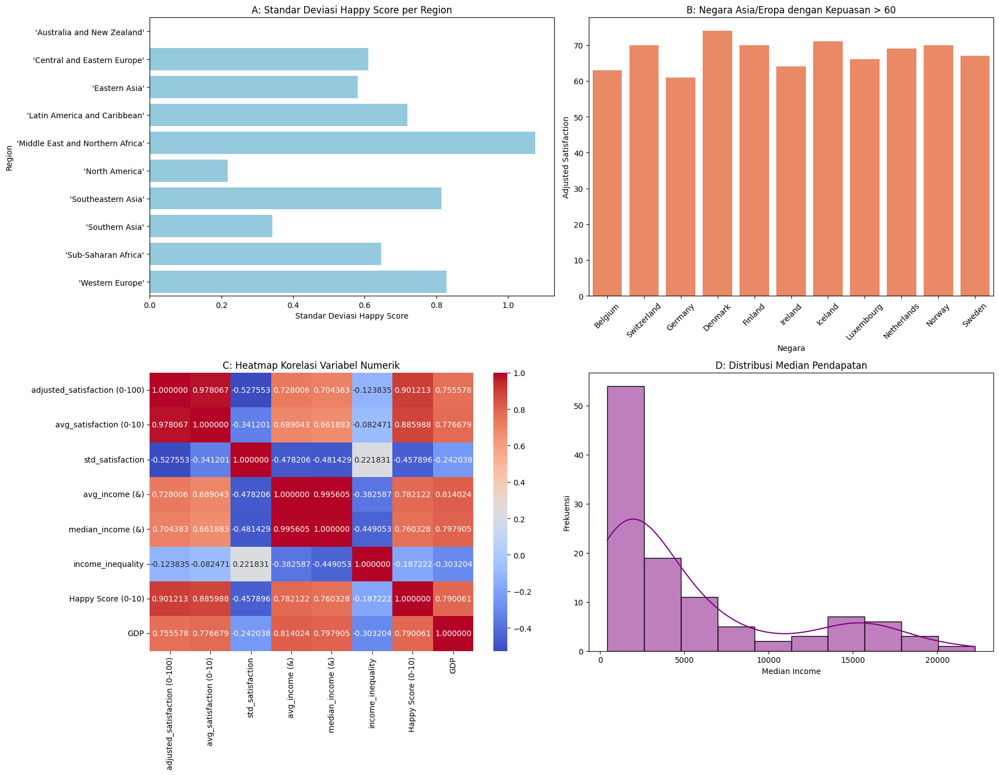

# 📊 Analisis Data Kebahagiaan Dunia

## 📌 Deskripsi Proyek
Proyek ini bertujuan untuk menganalisis data kebahagiaan dunia (*Happiness and Satisfaction Dataset*) menggunakan metode statistik dan visualisasi data. Analisis dilakukan untuk memahami hubungan antara tingkat kebahagiaan, pendapatan, kepuasan hidup, serta faktor ekonomi lainnya di berbagai negara.

---

## 🎯 Tujuan Analisis
- Menghitung standar deviasi **Happy Score (0–10)** berdasarkan wilayah (*Region*)
- Memfilter negara di **Asia dan Eropa** dengan **Adjusted Satisfaction > 60**
- Menganalisis hubungan antar variabel numerik menggunakan **Heatmap Korelasi**
- Menampilkan distribusi **Median Income** dalam bentuk **Histogram + KDE**

---

## 📈 Hasil Visualisasi

---

## 🧾 Penjelasan Grafik

### 🔹 A. Standar Deviasi Happy Score per Region
Grafik ini menunjukkan tingkat variasi kebahagiaan di setiap wilayah. Wilayah seperti *Middle East and Northern Africa* memiliki variasi kebahagiaan yang tinggi, sedangkan *North America* memiliki variasi yang lebih rendah.

### 🔹 B. Negara Asia & Eropa dengan Kepuasan > 60
Grafik ini menampilkan negara-negara di Asia dan Eropa yang memiliki tingkat kepuasan hidup tinggi. Negara-negara Eropa mendominasi dengan nilai yang lebih tinggi dibandingkan wilayah lainnya.

### 🔹 C. Heatmap Korelasi
Heatmap menunjukkan hubungan antar variabel:
- GDP dan Income memiliki korelasi yang sangat kuat
- Happy Score memiliki hubungan positif dengan tingkat kepuasan
- Income Inequality cenderung berdampak negatif terhadap kebahagiaan

### 🔹 D. Distribusi Median Income
Distribusi median income bersifat tidak merata (skewed ke kanan), yang menunjukkan bahwa sebagian besar negara memiliki tingkat pendapatan rendah hingga menengah.

---

## ⚙️ Metodologi
- Data Cleaning (menghapus missing values)
- Filtering data berdasarkan kriteria tertentu
- Analisis statistik (standar deviasi dan korelasi)
- Visualisasi data menggunakan berbagai grafik

---

## 🛠️ Tools & Library
- Python  
- Pandas  
- Matplotlib  
- Seaborn  
- Jupyter Notebook  

---

## 📂 Struktur Project
project-folder/
│
├── kategori A.ipynb
├── kategori B.ipynb
├── kategori C.ipynb
├── kategori D.ipynb
├── grafik_gabungan.png
└── README.md

---

## 👥 Pembagian Tugas Kelompok

- **Muhammad Shofwan Abdillah**  
  Koordinator proyek, preprocessing data, dan pembuatan visualisasi A (standar deviasi per region)

- **Endra Maulana**  
  Filtering data dan pembuatan visualisasi B (negara Asia & Eropa dengan kepuasan > 60)

- **Jourdan Calisto**  
  Analisis korelasi dan pembuatan heatmap (visualisasi C)

- **Ghustafad Maulana Erfin Putra**  
  Analisis distribusi data dan pembuatan histogram + KDE (visualisasi D)

---

## 🚀 Cara Menjalankan

1. Clone repository
2. Install dependencies
3. Jalankan Jupyter Notebook
4. Buka file:
- kategori A.ipynb
- kategori B.ipynb
- kategori C.ipynb
- kategori D.ipynb

---

## 📊 Kesimpulan

- Tingkat kebahagiaan memiliki hubungan kuat dengan faktor ekonomi seperti GDP dan pendapatan
- Terdapat perbedaan signifikan antar wilayah dalam variasi kebahagiaan
- Distribusi pendapatan global masih belum merata
- Negara dengan tingkat kepuasan tinggi didominasi oleh wilayah Eropa

---
